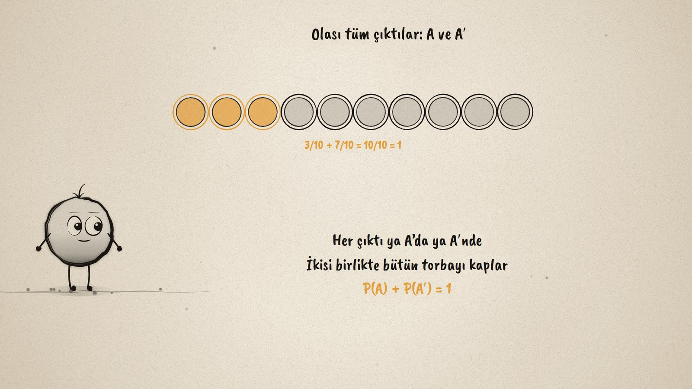
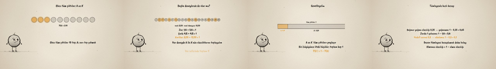

# Olsun ya da Olmasın · An Event and Its Complement

**▶ Tarayıcıda izleyin / Watch in the browser:** https://hakanatas.github.io/olsun-olmasin/ 
**⬇ MP4 + altyazılar / MP4 + subtitles:** [Releases](https://github.com/hakanatas/olsun-olmasin/releases) 
**✎ Kullanılan istem / The prompt behind it:** [PROMPT.md](PROMPT.md) 
**🎞 Bütün filmler / All films:** [Nokta'nın Filmleri](https://hakanatas.github.io/nokta-filmleri/?sinif=7)

> **TR —** 7. sınıf matematik "Veriden Olasılığa" temasındaki MAT.7.7.1 öğrenme çıktısı için hazırlanmış, tamamen JavaScript ile çizilen 92 saniyelik mürekkep animasyonu. Torbada 3 sarı, 7 siyah top var; A olayı sarı top çekmek. Olası tüm çıktılar diziliyor: P(A) = 3/10, sarı çekmemek A'nın tümleyeni A′ ve P(A′) = 7/10; her çıktı ya A'da ya A′nde, toplam 1. Aynı gözlem başka deneylerde tekrarlanıyor: zarda 6 gelmesi (1/6 + 5/6), sekiz bölmeli çarkta çift sayı (4/8 + 4/8), 1–20 kartlarında asal sayı (8/20 + 12/20): her seferinde toplam 1. Tümevarımla genelleniyor: A ve A′ tüm çıktıları paylaşır, P(A′) = 1 − P(A); biri büyüyünce öteki küçülüyor. Son olarak tümleyenle hızlı hesaplar yapılıyor: yağmur yağmama 0,65, zarda 1 gelmeme 5/6, ıskalama 0,2. Altyazılar Türkçe, İngilizce ya da ikisi birlikte seçilebilir.

A 92-second ink animation for **7th-grade maths**. Nokta, the ink character from [The Learning Ink](https://github.com/hakanatas/the-learning-ink), is the guide again. Every experiment is the same call, `tokens(n, labels, inA)` in `scenes/scene1.js`: the bag, the die, the spinner and the cards only differ in how many outcomes there are and which of them belong to A, so the pattern the film asks students to notice is literally the same code each time.

## Learning outcome

MEB, Türkiye Yüzyılı Maarif Modeli, Ortaokul Matematik, 7th grade, "Veriden Olasılığa" theme:

**MAT.7.7.1. Bir olayın ve tümleyeninin olasılığına ilişkin tümevarımsal akıl yürütebilme**
- a) Bir olayın olasılığını hesaplamaya ilişkin olası tüm çıktıları gözlemler.
- b) Bir olayın ve tümleyeninin olasılığını hesaplamak için matematiksel ilişkiyi bulur.
- c) Bir olayın ve tümleyeninin olasılığının ilişkisine yönelik genelleme yapar.

## Scenes

| # | Time | Scene | What happens | Outcome |
|---|---|---|---|---|
| 1 | 0–10 s | Torba | 3 amber and 7 black balls; A: drawing amber. | a |
| 2 | 10–28 s | A ve A′ | All 10 outcomes: P(A) = 3/10, P(A′) = 7/10, together 1. | a, b |
| 3 | 28–46 s | Başka deneyler | A die, a spinner, number cards: the sum is 1 every time. | b |
| 4 | 46–64 s | Genelle | A and A′ share all outcomes: P(A′) = 1 − P(A). | c |
| 5 | 64–80 s | Kullan | Rain 0,35 → 0,65; not rolling 1 → 5/6; hit 0,8 → miss 0,2. | c |
| 6 | 80–92 s | Aklında kalsın | P(A) + P(A′) = 1. | a–c |

## Running it

- **Preview:** double-click `index.html` (it works offline).
- **MP4:** run `npm install` once, then `npm run export -- --format=horizontal --captions=tr`.
- **Subtitles and narration:** `npm run srt` writes `out/captions_*.srt` and `narration_notes.txt`.
- **Editing:**
  - Caption text, timings and narration notes: `captions.js`
  - Everything on screen is drawn by `LI.world(t)` in `scenes/scene1.js` (the outcomes, the bar, the words); the other scenes only set the camera.
  - Nokta's poses: `src/draw/film.js`; layout for 16:9 and 9:16: `src/draw/kd.js`

It uses the same engine as The Learning Ink: `renderFrame(t)` as a pure function of time, seeded randomness, and frame-by-frame export.
